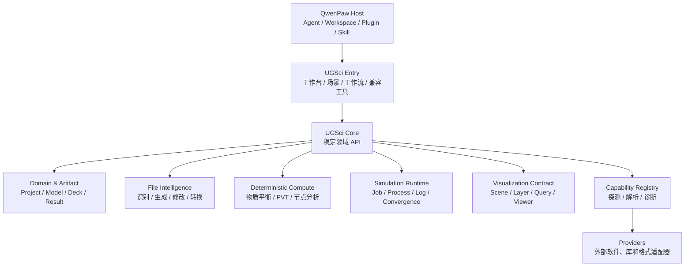
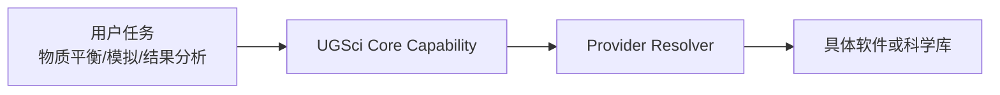
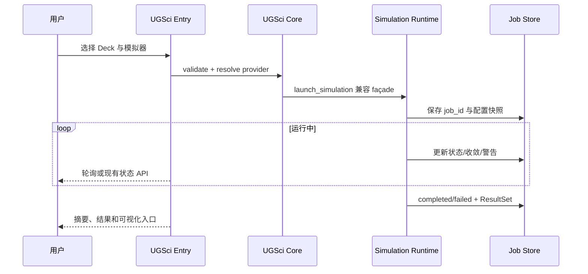

# UGSci 全局、高层次架构 Review 与治理路线

> 文档状态：当前架构基线 / 讨论稿
> 更新日期：2026-08-10
> 当前范围：UGSci 自身架构、领域内核、Provider、模拟运行、文件智能、确定性计算和可视化
> 明确不纳入当前实施：PawApp SDK、TaskManager、SSE 迁移。它们作为后期适配项保留，不应反向决定当前 UGSci 的领域边界。

> 2026-08-10 实施更新：原 `oilgas-visualization` 独立插件已经完整并入
> UGSci。后端、Reader/Converter、Job/Cache、契约、数据、技能和懒加载
> Viewer Runtime 由 UGSci 统一发布；`file_artifacts` 负责公用格式检测和
> 转换编排。用户仍从 UGSci UI 的 `/oilgas-visualization` 页面进入。

## 1. 结论先行

UGSci 当前最需要解决的不是增加更多工具，而是把“产品入口、领域内核、具体实现”分层。建议形成：

```text
QwenPaw 平台
└── UGSci 唯一入口
    └── UGSci Core（内部领域内核）
        ├── Domain & Artifact
        ├── File Intelligence
        ├── Deterministic Compute
        ├── Simulation Runtime
        ├── Visualization Contract
        └── Capability Registry
            └── 多个 Provider
```

核心判断：

- QwenPaw 是平台核心，UGSci 是领域产品，不应复制平台能力；
- 用户只需要一个 UGSci 入口，不需要同时理解 `ugsci`、`ugsci_core` 和 `oilgas-visualization` 三个产品入口；
- `UGSci Core` 可以先作为 UGSci 内部模块，不必立即拆成第二个可见插件或独立发行包；
- Eclipse、CMG、tNavigator、COMSOL、NeqSim、xtgeo、Three.js 和通用科学库都应是 Provider/适配器；
- 现有 `launch_simulation`、`job_store`、旧工具名和 skills 是兼容锚点，先治理边界，再替换内部实现；
- PawApp 等长任务 UI 基础设施成熟后再接入，当前先把 Job 状态、事件、产物和错误分类定义清楚。

## 2. 当前项目 Review

### 2.1 已有优势

项目已经形成一条可工作的能力链：

1. QwenPaw 提供 Agent、Workspace、Tool、Skill、Plugin 和会话基础设施；
2. `plugins/bundle/ugsci/plugin.py` 已经是 UGSci 的注册入口；
3. `engine/tools/launcher.py` 提供 `launch_simulation`，并有状态检查、等待和结果读取工具；
4. `job_store` 已承担模拟作业元数据、进程检测和恢复相关职责；
5. reservoir simulation、history matching、sensitivity analysis 等 skills 已经表达了业务流程；
6. 油气 Viewer Runtime 已迁入 UGSci，并保持独立懒加载构建；
7. `ugsci_research` 可以承载研究性质的扩展，避免核心安装面继续膨胀。

### 2.2 主要问题

#### 入口职责过重

入口文件同时承担插件注册、团队 API、技能池、仿真监控、引擎能力注册和部分业务编排。短期可以工作，但会造成：

- 新增能力需要修改入口和多个注册点；
- UI、HTTP、工具和计算逻辑相互引用；
- 兼容代码与新代码混在同一层；
- 测试只能从插件整体启动，难以测试单个领域服务。

目标是让入口只负责装配和公开兼容接口，业务实现下沉到 Core。

#### `engine` 语义混杂

当前 `engine/` 既像外部模拟器运行时，又像确定性计算内核。建议把它的主要语义收敛为 `simulation_runtime`：负责进程、工作目录、日志、收敛和结果生命周期；确定性公式和工程计算另设 `deterministic`。

#### Provider 与领域能力没有分级

NeqSim、xtgeo、SymPy、PyMC、Pymoo、NetworkX 是实现技术或通用库；物质平衡、PVT、节点分析、历史拟合、井网分析才是用户理解的油气能力。两者需要分层，不能并列堆在顶层菜单和核心依赖中。

#### 可视化产品归属不清

油气 Viewer Runtime 作为 UGSci 的专业 Viewer 能力继续独立懒加载构建。它应暴露场景/图层/查询契约，而不是让 UGSci 入口直接依赖 Three.js 细节。

#### 源码、发布副本和生成产物需要持续治理

当前已经有 canonical source → package mirror 的同步约束。后续必须保持单一手写源、显式同步清单和 CI 漂移检查，避免在重构时产生“本地能跑、发布包不是这一份代码”的问题。

### 2.3 验证信号

- UGSci canonical source 到 package mirror 检查通过；
- UGSci + oilgas visualization 专项测试：523 passed，1 warning；
- UGSci UI TypeScript 检查通过；
- `oilgas-visualization` UI TypeScript 检查失败：`ui/src/viewer/mount.tsx:13` 类型导入路径错误，另有 3 个 implicit any。

结论不是“现在必须重写”，而是应优先建立边界和质量门禁，让后续拆分可验证、可回滚。

## 3. 目标架构

### 3.1 分层图



### 3.2 三条依赖规则

1. **入口依赖 Core，Core 不依赖具体 UI。** Core 可以被工具、CLI、测试和未来 PawApp 外壳复用。
2. **Core 依赖 capability contract，不直接依赖厂商实现。** 具体 Provider 通过 registry 注入。
3. **Provider 不反向控制产品模型。** Provider 适配 UGSci 的输入/输出和错误模型，不把自己的对象层泄漏到入口。

## 4. UGSci Core 的职责划分

### 4.1 Domain & Artifact

统一领域对象：

- `Project`：项目、工作区、权限和默认配置；
- `Model`：网格、地质、PVT、SCAL、井和边界条件引用；
- `Deck`：原始文本、解析结构、版本、单位和修改补丁；
- `SimulationJob`：一次可恢复的运行作业；
- `ResultSet`：结果文件、摘要、时间步、指标和来源；
- `VisualizationScene`：场景、图层、查询条件和时间状态；
- `AnalysisReport`：确定性指标、诊断、建议和不确定性。

大文件和二进制结果使用 `ArtifactRef`，领域对象只存元数据、校验和、来源和权限信息。

### 4.2 File Intelligence

文件智能应是一条流水线，而不是一组互不相关的脚本：

```text
detect → parse → normalize → validate → patch/generate → convert → explain
```

它需要覆盖：

- 数值模拟文件识别：模拟器、版本、格式、编码、单位和关联文件；
- 结构化解析：保留原始文本和 source span；
- 文件生成：从领域模型生成 Deck 和配置；
- 安全修改：生成 diff、校验报告和可回滚 patch；
- 格式转换：明确单位转换和有损字段；
- 解释结果：告诉用户检测到的格式、修改内容和无法保证的部分。

所有写操作都应返回 `ArtifactRef + ValidationReport + DiffSummary`，不只返回一个路径。

### 4.3 Deterministic Compute

这是 UGSci 的可审计数学内核，优先建设：

- 物质平衡、容积、储量和采收率计算；
- PVT 和相态基础计算；
- 井筒、管网和节点分析；
- 产能、压力、注采约束和单位换算；
- 模拟前预估与模拟后 sanity check；
- 质量守恒、边界条件和数值容差检查。

每个计算函数必须显式声明输入单位、输出单位、版本、容差和适用范围；结果带 provenance。随机优化、历史拟合和不确定性分析放在 workflow/Provider 层，不混入确定性内核。

### 4.4 Simulation Runtime

Runtime 管理外部模拟器生命周期：

- 创建隔离执行目录；
- 解析 simulator/deck/provider；
- 启动、监控、恢复、超时和取消进程；
- 采集 stdout/stderr、日志、退出码和收敛指标；
- 产出统一 Job 状态和 ResultSet 引用；
- 对许可证、平台差异和进程树提供诊断。

现有 `launch_simulation` 保留为兼容 façade。新的内部接口可以逐步变成：

```python
job = await runtime.launch(
    simulator="eclipse",
    deck=deck_artifact,
    config=run_config,
)
```

但旧工具名、参数和返回结构在迁移完成前不变。

### 4.5 Visualization Contract

可视化层定义领域契约，不让页面直接依赖底层渲染库：

- 场景、图层、网格、井、轨迹、属性和时间步；
- 点/井/单元/剖面查询和选择；
- 大数据切片、LOD、懒加载和缓存；
- Viewer mount/dispose/resize 生命周期；
- 截图、报告导出和错误边界。

可视化代码已归入 UGSci，并继续保持懒加载 Viewer Runtime；通过 UGSci Provider 注册 `scene`、`layer`、`query` 等能力。

### 4.6 Capability Registry

Registry 用于声明和解析能力，而不是只做“软件是否安装”的布尔检测：

```yaml
capability: simulation.eclipse
provider: eclipse_adapter
version: "2025.x"
platforms: [macos, linux, windows]
requires: [license.eclipse]
status: available
```

状态至少区分：`available`、`unavailable`、`misconfigured`、`incompatible`。可选 Provider 失败不能阻止 UGSci 启动，但必须提供可操作诊断。

## 5. “一个入口、一个 Core、多个 Provider”的产品形态

### 5.1 用户看到的 UGSci

建议 UGSci 工作台围绕用户任务组织，而不是围绕代码包组织：

- 项目与模型；
- 文件智能；
- 模拟任务中心；
- 确定性工程计算；
- 可视化与结果探索；
- 工作流与报告；
- Provider/环境诊断。

Eclipse、CMG、NeqSim 等应出现在“可用能力/运行环境”中，而不是让用户首先面对一组平行插件。

### 5.2 领域能力与技术 Provider 的关系



例如“物质平衡”是 Core capability；NeqSim 或自研公式实现是 Provider。这样可以替换实现而不改变用户工作流和报告结构。

## 6. 现有模块到目标模块的映射

| 当前模块 | 目标职责 | 第一阶段动作 |
| --- | --- | --- |
| `plugins/bundle/ugsci/plugin.py` | Entry/装配 | 仅保留注册、兼容层和依赖装配 |
| `ugsci/team/*` | Team API/工作流状态 | 与模拟 Core 解耦，保持独立测试 |
| `ugsci/engine/tools/launcher.py` | Runtime façade | 不改公开函数，抽出内部 runner/provider 接口 |
| `ugsci/engine/tools/job_store.py` | Job repository | 先定义 schema、状态机和并发约束 |
| `ugsci/engine/tools/monitor.py` | 状态采集器 | 输出统一 convergence/progress 事件模型 |
| `ugsci/engine/tools/result_reader.py` | ResultSet 读取 | 返回 ArtifactRef、摘要和来源信息 |
| `ugsci/sim_api.py` | 模拟中心查询 | 通过 repository/service 访问，不直接拼底层字典 |
| `ugsci/engine/detector.py` | Provider discovery | 拆分软件探测、许可证探测和 resolver |
| `ugsci/visualization` | Visualization Provider | 已完成独立插件归并；继续收敛 Scene/Layer/Query contract |
| `ugsci_research` | 可选研究扩展 | 保持 optional，不能成为核心硬依赖 |

## 7. 模拟任务中心：当前应先做什么

虽然暂不采用 PawApp/TaskManager，但模拟中心仍然需要自己的稳定任务模型，避免未来迁移时再返工。

### 7.1 Job 与事件模型

建议先在 UGSci Runtime 内定义：

- 持久 `job_id`；
- `created / validating / starting / running / stalled / completed / failed / cancelling / cancelled` 状态；
- 单调 `sequence` 和唯一 `event_id`；
- 事件类型：`process.started`、`progress`、`convergence`、`warning`、`completed`、`failed`、`cancelled`；
- 日志、Deck、结果和分析报告的 Artifact 引用；
- `project_id`、`agent_id`、`user_id`、simulator/provider 及配置快照。

未来无论接入 PawApp SSE、WebSocket 还是其他前端通道，都只需把这些事件映射到传输层。

### 7.2 当前模拟中心的最小闭环



### 7.3 暂不做的事情

- 不把 PawApp `TaskManager` 当作 Job Store；
- 不把 SSE 作为唯一事实来源；
- 不在当前阶段迁移 `job_store` 到 `ctx.storage`；
- 不为了接入长任务而重写 `launch_simulation`；
- 不在没有统一 Artifact/事件模型前扩展多个前端实时通道。

## 8. 分阶段治理路线

### 阶段 0：边界和质量基线

- 固定 canonical source 与 package mirror 的同步检查；
- 为入口、Runtime、Job Store、File Intelligence、Compute、Visualization 建立模块级测试入口；
- 定义领域对象、错误分类、ArtifactRef 和 Job 状态 schema；
- 保持 UGSci Viewer TypeScript 类型检查和独立构建门禁；
- 入口只保留注册编排，团队 API 和仿真监控逐步提取。

验收：Python/TypeScript 检查可重复运行；模块级测试不依赖完整插件启动；旧工具调用不回归。

### 阶段 1：模拟 Runtime 收敛

- 保留 `launch_simulation`；
- 把 simulator 检测、工作目录、进程生命周期、日志采集、收敛解析抽到 Runtime service；
- 为 Eclipse/CMG/COMSOL 建立 provider contract 和 fake；
- 统一 Job 状态、退出码、错误和恢复行为；
- `sim_api` 只通过 Job repository/service 查询。

验收：服务重启后可发现和恢复 Job；超时、崩溃、许可证缺失和取消都有明确状态；旧 skill 仍可运行。

### 阶段 2：文件智能

- 先做 detect/validate/read-only；
- 再做结构化 patch 和 diff；
- 最后做生成和跨格式转换；
- 每个 parser/provider 保留 source span、单位和未知字段；
- 所有写操作可回滚并生成校验报告。

验收：识别错误不破坏原文件；round-trip 保留未知字段；修改前后 diff 可解释；转换明确有损字段。

### 阶段 3：确定性计算引擎

- 建立单位系统、数值容差和 provenance；
- 优先物质平衡、PVT、节点分析和 sanity check；
- 为每个公式建立基准数据和边界测试；
- 输出可供报告和可视化直接消费的结构化结果。

验收：给定固定输入结果可复现；单位错误和边界错误被显式拒绝；结果带版本和来源。

### 阶段 4：可视化融合

- 定义 Scene/Layer/Query/Artifact contract；
- 将 UGSci 内置 Viewer Provider 接入统一 Scene/Layer/Query contract；
- 统一网格、井、属性、时间步和结果摘要的 ID；
- 处理大结果的切片、LOD、懒加载和 dispose；
- 通过截图/报告导出验证用户工作流。

验收：无 Viewer 时 UGSci 仍可运行计算和结果查询；Viewer 加载失败有降级信息；重复 mount/dispose 不泄漏。

### 阶段 5：工作流和研究扩展

- 将 history matching、sensitivity analysis、optimization 建立在 Core command 和 Artifact 上；
- `ugsci_research` 只依赖公开 Core contract，不反向修改入口；
- 将 Agent 编排与确定性结果分开，报告中标注计算来源与模型建议。

验收：研究扩展可独立启停；核心安装不被大型可选依赖拖累；工作流状态可复盘。

### 阶段 6：未来 PawApp/实时通道适配（后置）

只有在 PawApp 具备以下条件后才启动：

- Task 持久化和服务重启恢复；
- SSE replay、sequence、Last-Event-ID 和多订阅者；
- confirm 的 pending/resolve/timeout 闭环；
- 服务端 cancel 能影响后台 Job；
- storage 具备明确作用域、事务和恢复语义；
- notify/toast 有真实投递和失败可观测性。

届时只做事件和 Job API 的适配，不修改 UGSci Core 的领域模型，也不让 PawApp Task 取代 `job_id`。

## 9. 风险与回滚

| 风险 | 影响 | 缓解 |
| --- | --- | --- |
| 过早拆包 | 导入路径和发布流程回归 | 先逻辑分层，后物理移动；保留兼容 import |
| Runtime 与领域计算继续混杂 | 难测试、难替换 | 明确纯计算接口与外部进程接口 |
| Provider 缺失阻塞启动 | 用户无法进入 UGSci | capability 分级、lazy import 和诊断 |
| Deck 修改误覆盖 | 模型损坏 | dry-run、diff、备份、结构化 patch |
| 大结果进入通用 storage | 性能和恢复风险 | ArtifactRef + 专用结果存储 |
| 可视化强耦合 Three.js | UI 无法替换、构建变慢 | Viewer contract、懒加载和独立 Provider |
| 一次性重写 `launch_simulation` | 旧 skill 失效 | 兼容 façade、双路径验证、feature flag |

任何阶段都可以关闭新模块的 feature flag，回退到现有入口、`launch_simulation`、`job_store` 和旧 sim API；新元数据不应成为旧路径运行的必需条件。

## 10. 测试矩阵与发布门禁

### 单元/契约

- Domain 对象序列化、schema 版本和单位；
- Deck parser/generator/patch round-trip；
- 确定性计算基准、容差、边界和错误；
- Provider registry 的 available/unavailable/misconfigured/incompatible；
- Runtime 的启动、退出码、超时、stalled、cancel 和恢复；
- Job Store 并发、原子写入、损坏恢复和清理；
- Visualization contract、Viewer mount/dispose/resize。

### 集成/端到端

- fake simulator 生成可控日志、收敛和失败；
- 服务重启后 Job 仍可查询；
- Deck 拒绝或超时不写盘；
- 结果 Artifact 与报告来源可追踪；
- 旧工具、skills、团队 API 与新 Core 同时工作；
- 无可用外部软件时 UGSci 仍能进入诊断/只读模式。

### 发布门禁

- canonical source/package mirror check；
- UGSci Python/TypeScript 检查；
- UGSci Viewer 类型错误保持清零；
- 专项测试保持当前通过基线（523 passed，1 warning）；
- 生成产物、`dist`、`node_modules` 不进入手写源码质量扫描；
- Git diff 审核，确保不覆盖用户已有改动。

## 11. 建议 ADR

### ADR-001：UGSci 唯一入口与内部 Core

用户只面对 UGSci Entry；Core 是内部稳定领域 API；具体软件和库通过 Provider 接入。

### ADR-002：Simulation Job 是持久事实

`job_id`、Job 状态、Artifact 和事件顺序由 UGSci Runtime/Job Repository 负责。未来任何 UI 长任务系统都只能作为观察和操作层。

### ADR-003：File Intelligence 输出可审计 Artifact

识别、生成、修改和转换必须保留原始文件、diff、校验报告、单位和来源。

### ADR-004：Deterministic Compute 与 Agent 分离

公式和数值结果先由确定性引擎产出；Agent 负责解释、编排和建议，不改变事实结果。

### ADR-005：Visualization 通过领域契约接入

Viewer Runtime 可独立构建和懒加载，但只通过 Scene/Layer/Query/Artifact contract 与 UGSci Core 交互。

## 12. 下一轮建议先讨论的 5 个问题

1. `UGSci Core` 先落在 `plugins/bundle/ugsci/core`，还是现在就建立独立共享包？
2. `job_store` 是否先演进为明确的 Job Repository 接口，再评估 SQLite/数据库实现？
3. 文件智能第一批支持哪些格式和模拟器，哪些只做识别/校验，哪些允许写入？
4. 确定性计算第一批是否锁定物质平衡、PVT、节点分析和单位系统？
5. UGSci Viewer 的 Scene/Layer/Query contract 第一批应覆盖哪些对象和交互？

推荐顺序是先定 1、2、3，再开始阶段 0/1；这样后续实现不会被某个具体模拟器或前端框架反向绑死。

## 附：主要代码与既有文档

- `src/qwenpaw/pawapp/app.py`、`context.py`、`task.py`：未来 PawApp 适配时参考，当前不作为 UGSci 前置依赖
- `plugins/bundle/ugsci/plugin.py`：UGSci 当前入口
- `plugins/bundle/ugsci/engine/tools/launcher.py`：现有 `launch_simulation`
- `plugins/bundle/ugsci/engine/tools/job_store.py`：现有 Job 状态存储
- `plugins/bundle/ugsci/sim_api.py`：模拟查询 API
- `docs/UGSCI_IMPROVEMENT_PLAN.md`：既有 UGSci 工程治理计划
- `docs/OILGAS_VISUALIZATION_PLUGIN_IMPLEMENTATION_PLAN.md`：油气可视化插件计划
