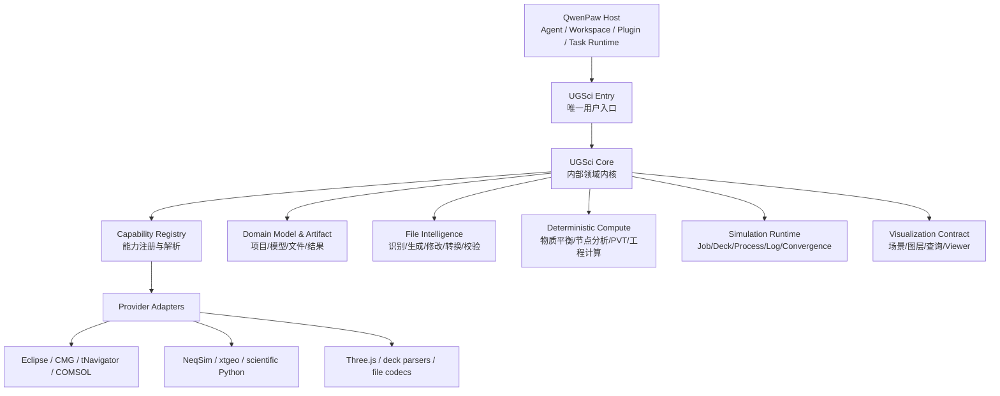
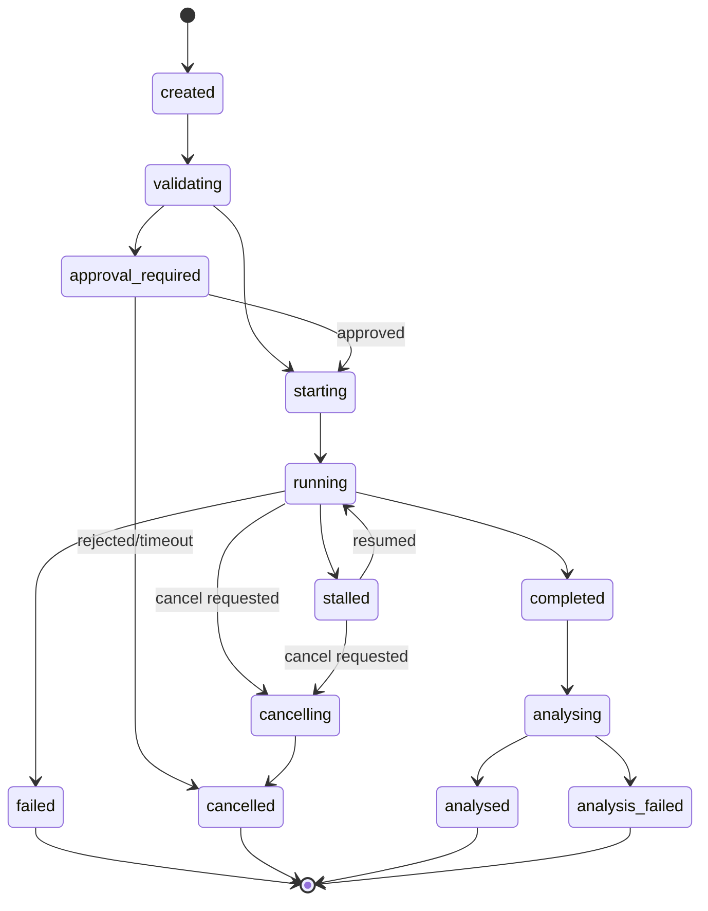
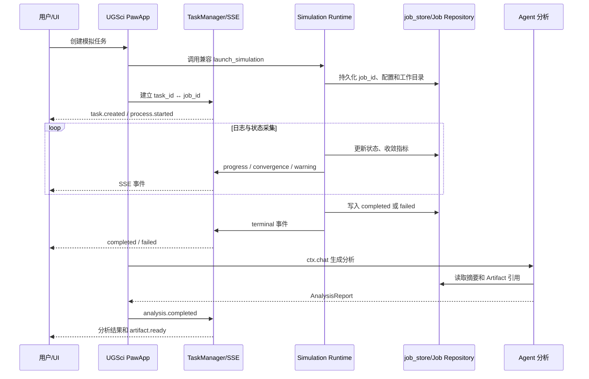

# UGSci 全局架构 Review 与 PawApp 模拟任务中心增量迁移方案（历史讨论稿）

> 当前架构基线已移至 [`UGSCI_GLOBAL_ARCHITECTURE_REVIEW.md`](./UGSCI_GLOBAL_ARCHITECTURE_REVIEW.md)。本文件保留 PawApp 迁移讨论，供后期 SDK 成熟后参考；不代表当前实施范围。

> 文档状态：讨论稿 / Architecture Review + Migration RFC
> 更新日期：2026-08-10
> 适用范围：QwenPaw 主平台、`ugsci`、`ugsci_research`、`oilgas-visualization` 及 PawApp SDK 相关运行时
> 本文只定义架构方向、边界、契约和迁移顺序，不在本轮直接修改现有业务代码。

## 1. 执行摘要

当前项目已经具备 QwenPaw 平台、UGSci 领域插件、油气可视化插件、模拟器启动/监控工具和 PawApp SDK 骨架，但这些能力的产品边界还没有完全收敛。最重要的判断是：UGSci 不应该继续演化成一个包含所有科学库和所有 UI 的“大插件”，也不应该马上被整体重写。

推荐的目标形态是：

1. QwenPaw 继续作为平台核心，提供 Agent、工具、技能、会话、插件、通知和任务运行时。
2. `ugsci` 成为用户唯一可见的领域入口，负责工作台、场景、工作流和能力编排。
3. 一个内部的 `UGSci Core` 负责领域模型、文件智能、确定性计算、模拟运行、可视化契约和能力注册；它不必成为第二个用户可见插件。
4. Eclipse、CMG、tNavigator、COMSOL、NeqSim、xtgeo、Three.js 以及 SymPy/PyMC/Pymoo/NetworkX 等作为 Provider 或可选适配器接入，而不是彼此平行、无边界地堆在 UGSci 顶层。
5. 先把“模拟任务中心”作为独立 PawApp 外壳：保留现有 `launch_simulation` 和 `job_store`，把进度、收敛、完成事件桥接到 PawApp Task/SSE，再逐步接入 storage、确认、取消和自动分析。

这条路线的核心是“先建立稳定边界，再迁移实现”。PawApp 的目标能力很适合模拟中心，但当前 SDK 仍是骨架，存在任务持久化、SSE replay、确认流程、取消语义和通知投递等生产阻塞，必须先列为 M0 运行时补齐项。

## 2. 当前项目全局 Review

### 2.1 已经形成的能力

当前仓库已经有以下可复用基础：

| 领域 | 现状 | 价值 |
| --- | --- | --- |
| 平台 | QwenPaw 提供 Agent、Workspace、Tool、Skill、Plugin 和会话基础设施 | 适合作为所有科学能力的宿主 |
| UGSci 入口 | `plugins/bundle/ugsci/plugin.py` 注册工具、路由和能力 | 已经是领域插件入口，但职责偏多 |
| 模拟运行 | `engine/tools/launcher.py` 的 `launch_simulation`、状态检查、结果读取、Deck 编辑 | 是迁移的兼容锚点，暂不应替换 |
| 作业状态 | `engine/tools/job_store.py` 及 `sim_api.py` | 支持进程恢复和已有监控逻辑 |
| 工作流 | reservoir simulation、history matching、sensitivity analysis 等 skills | 已能表达领域工作流，但需要统一状态和产物模型 |
| 可视化 | `oilgas-visualization` 提供独立 Viewer Runtime 和油气图形能力 | 适合作为 UGSci 的 Viewer Provider/内部模块 |
| 研究扩展 | `ugsci_research` 包含 LangChain、数据集、科研工具等扩展 | 保持可选，避免污染核心安装面 |
| PawApp SDK | `PawApp`、`PawAppContext`、`TaskManager`、Console PawTask 已有初步实现 | 可作为模拟中心的应用外壳，但还不能直接视为生产级任务系统 |

### 2.2 主要结构性问题

#### 入口和核心边界不清

`ugsci` 的入口、团队 API、技能池、模拟监控、引擎注册和前端状态管理目前仍有较强耦合。入口文件承担了过多实现细节，导致以下问题：

- 用户看到的“UGSci”与内部计算/运行时模块没有清楚分层；
- 新增一个模拟器或文件格式时，容易修改入口和多个工具注册点；
- `oilgas-visualization` 既像独立插件，又像 UGSci 的一部分，产品归属和依赖方向不够明确；
- 发布源码与 package mirror 需要同步治理，重复实现会增加漂移风险。

#### “引擎”概念混杂

当前 `engine/` 同时承载模拟器启动、进程监控、结果读取和领域计算的语义。建议把它明确为 `simulation_runtime`，把“确定性油气藏计算”与“外部模拟器进程生命周期”分开：

- `Deterministic Compute`：无副作用、可测试、给定输入即得到确定输出的方程/分析能力；
- `Simulation Runtime`：Deck、进程、日志、收敛、结果文件和外部许可证的生命周期；
- `Provider Registry`：按能力解析实际实现，而不是让业务代码直接 import 某个库。

#### 研究库与油气能力没有分级

SymPy、PyMC、Pymoo、NetworkX 等是通用技术 Provider。物质平衡、节点分析、PVT、井网/管网、历史拟合等才是面向油气用户的领域能力。二者若都作为一级“引擎”展示，会使安装、配置、测试和产品叙事失控。

#### 长任务已有作业模型，但没有统一的 UI 任务模型

`launch_simulation` 返回 `job_id`，`job_store` 负责运行态和恢复；PawApp `TaskManager` 则生成内存中的 `task_id` 和 SSE 队列。两者不是同一个概念，若直接混用会造成刷新丢状态、服务重启后任务消失、取消只断开浏览器连接而不停止进程等问题。

### 2.3 当前验证信号

- UGSci canonical source 到 package mirror 的一致性检查通过；
- UGSci + oilgas visualization 专项测试：523 passed，1 warning；
- UGSci UI TypeScript 检查通过；
- `oilgas-visualization` UI TypeScript 检查失败：`ui/src/viewer/mount.tsx:13` 类型导入路径错误，另有 3 个 implicit any。

这些结果说明“核心功能可以继续演进”，但也说明前端包边界和类型门禁尚未完全收敛。工作树中已有用户改动，应继续保留，不通过大规模移动或清理来制造假性整洁。

## 3. 目标架构：一个入口、一个 Core、多个 Provider

### 3.1 总体形态



### 3.2 边界原则

#### QwenPaw 是平台核心

QwenPaw 负责通用能力：Agent 调用、工具协调、技能加载、Workspace、会话/身份、插件生命周期、PawApp 上下文、长任务基础设施和跨渠道通知。UGSci 不应复制这些平台能力。

#### `ugsci` 是唯一用户入口

入口负责：

- UGSci 工作台和导航；
- 项目、场景、工作流和最近任务；
- 能力发现、专家/团队/技能的领域编排；
- 将用户动作转换成 Core command 或 PawApp task；
- 兼容现有工具名称和旧路由。

入口不负责：

- 直接维护每种模拟器的进程细节；
- 直接读写所有文件格式；
- 在一个文件里实现 UI 状态、团队 API 和计算算法。

#### `UGSci Core` 是内部领域内核

Core 是一个清晰的 Python/TypeScript 领域边界，可以先以现有目录中的模块逐步演进，不要求立即拆成独立发行包。它提供稳定的领域接口、类型、错误分类和产物引用。

#### Provider 可替换、可选、可探测

Provider 负责对接具体软件、库或格式。Provider 必须：

- 声明 capability、版本、平台和可用性；
- 将厂商错误映射为 UGSci 标准错误；
- 不把厂商对象泄漏到入口层；
- 支持 mock/fake 以便 CI 测试；
- 通过 registry/resolver 获取，而不是在业务代码中到处硬编码 import。

### 3.3 模块映射

| 当前位置/概念 | 目标定位 | 迁移策略 |
| --- | --- | --- |
| `plugins/bundle/ugsci/plugin.py` | UGSci Entry + 注册编排 | 逐步提取 team/api、sim center、capability registration；保留兼容工厂 |
| `ugsci/engine/tools/launcher.py` | `simulation_runtime` 的兼容 façade | 保留 `launch_simulation`，内部新增 adapter/bridge |
| `ugsci/engine/tools/job_store.py` | Simulation Job 的持久化/恢复存储 | 继续作为进程恢复权威；后续再抽象 repository |
| `ugsci/sim_api.py` | Sim Center 查询 API | 改为调用 Core job repository，不直接拼装底层结构 |
| `oilgas-visualization` | Visualization Provider/Viewer Runtime | 保留独立代码包、懒加载和可选安装；由 UGSci 注册能力 |
| `ugsci_research` | Research Extension | 维持 optional，不作为 UGSci Core 必需依赖 |
| `engine/detector.py` | Provider discovery | 逐步拆成平台探测、许可证探测和 capability resolver |
| Console `pawapp-sdk/task.ts` | PawTask 客户端 | 按统一 SSE envelope、重连和取消契约演进 |

## 4. UGSci Core 的六大子系统

### 4.1 Domain Model & Artifact

这是所有能力共同依赖的领域语言。至少需要定义：

- `Project`：项目、工作区、权限和默认模拟器；
- `Model`：地质模型、网格、PVT、SCAL、井和边界条件的版本引用；
- `Deck`：原始文件、解析后的结构、修改补丁和校验状态；
- `SimulationJob`：一次可恢复的运行作业；
- `ResultSet`：结果文件、摘要、时间步、指标和 Artifact URI；
- `VisualizationScene`：场景、图层、查询和选择状态；
- `AnalysisReport`：收敛、物质平衡、异常和建议。

大型二进制文件、日志和结果不应塞进 `ctx.storage`；领域对象保存 JSON 元数据和 Artifact 引用即可。

### 4.2 File Intelligence

文件智能不是“打开文件”这一项工具，而是一条可验证流水线：

1. 识别：文件格式、模拟器、版本、编码和可能的单位体系；
2. 解析：形成带 source span 的中间表示，保留原始文本；
3. 校验：语法、引用、单位、必需关键字和跨文件依赖；
4. 生成：从领域对象生成 Deck/配置文件；
5. 修改：以结构化 patch 修改，并产出 diff；
6. 转换：在明确的 lossiness/单位转换策略下跨格式转换；
7. 解释：告诉用户“检测到什么、改了什么、哪些内容无法保真”。

所有修改操作都应返回 `ArtifactRef + ValidationReport + DiffSummary`，而不是只返回一个临时路径。

### 4.3 Deterministic Compute

确定性计算引擎是 UGSci 的“可审计数学核心”，与外部模拟器解耦。优先范围：

- 物质平衡、容积和储量计算；
- PVT/相态基础计算；
- 井筒、管网和节点分析；
- 产能、压力和注采约束计算；
- 单位换算、质量守恒和边界条件检查；
- 模拟前的预估、模拟后的 sanity check。

约束：输入、单位、版本和数值容差必须显式；结果要有 provenance；同一输入在同一 Provider 版本下应可复现；随机算法（例如历史拟合优化）要放在上层 workflow/provider，不应混入确定性核心。

### 4.4 Simulation Runtime

Runtime 负责外部模拟器生命周期，而不是解释所有领域语义：

- 生成执行目录和安全命令行；
- 启动、监控、恢复和取消进程；
- 解析 stdout/stderr、日志和收敛指标；
- 管理许可证、超时、资源限制和退出码；
- 产出统一 `SimulationJob` 和 `ResultSet` 状态。

`launch_simulation(simulator, deck_file)` 是兼容入口；新的 Sim Center 通过 adapter 调用它，或在内部逐步把它改造成 Runtime façade，确保现有 Agent skill 和工具不被一次性打断。

### 4.5 Visualization

Visualization 需要定义领域级契约，而非让每个页面直接操作 Three.js：

- 场景和图层：网格、井、断层、属性、轨迹、时间步；
- 查询和选择：点、井、单元、时间步、剖面；
- 大数据加载策略：切片、LOD、懒加载和缓存；
- Viewer 生命周期：mount、dispose、resize、错误边界；
- 可访问性和截图/报告导出。

`oilgas-visualization` 可以继续作为独立包，保留独立构建和懒加载 Viewer Runtime；但它的产品能力应通过 UGSci Visualization Provider 暴露，避免用户在入口层看到两个互相竞争的领域产品。

### 4.6 Capability Registry

Registry 记录“有什么能力”和“当前能否使用”：

```yaml
capability: simulation.eclipse
provider: eclipse_adapter
version: "2025.x"
platforms: [macos, linux, windows]
requires: [license.eclipse]
status: available
```

解析流程应返回 `available / unavailable / misconfigured / incompatible`，并带可操作诊断。检测失败不能全部静默，也不能让一个可选 Provider 失败拖垮 UGSci 启动。

## 5. PawApp SDK 适配评估

### 5.1 目标能力与 UGSci 对应关系

| PawApp 能力 | 模拟中心用途 | 结论 |
| --- | --- | --- |
| `PawApp` | 提供模拟中心路由、工具和生命周期 | 适合作为独立外壳 |
| `PawAppContext` | 注入项目、Agent、用户和平台服务 | 需要补齐作用域与安全约束 |
| `ctx.storage` | 配置、最近任务、摘要、分析报告索引 | 先双写，不立即替代 `job_store` |
| `ctx.ui.push()` | 进度、收敛、警告、Artifact ready | 需要统一事件 envelope、replay 和节流 |
| `ctx.ui.confirm()` | 修改 Deck、覆盖文件、取消作业、删除结果 | 当前确认服务链路不可用，必须先修复 |
| `ctx.chat()` | 完成后生成收敛/物质平衡分析 | 作为 M4 自动分析入口 |
| `ctx.tools.invoke()` | 组合 `edit_deck → validate → launch` | 需要权限、递归调用和超时策略 |
| `ctx.toast()` | 当前页面的轻量提示 | 可做 UX 辅助，不能作为可靠审计事件 |
| `ctx.notify()` | 钉钉/桌面/渠道通知 | 当前是日志 stub，需接入 ChannelManager |
| `TaskManager + SSE` | 长任务状态流 | 方向正确，但需持久 Job + replay + cancel |

### 5.2 当前 SDK 生产阻塞项（M0）

以下是代码审查中确认的缺口，不能在迁移计划中隐含跳过：

1. **TaskManager 只保存在内存中。** 服务重启后 task 消失，没有事件 replay、`Last-Event-ID` 或 sequence；SSE 断开会丢历史事件。
2. **通用任务路由尚未确认真正注册。** `task.py` 注释描述了 `POST /api/pawapp/{app_id}/task` 和 stream 路由，但仓库搜索未发现与注释对应的统一路由注册；前端 SDK 目前按 app 自己的创建 endpoint 返回 `task_id`，之后固定连接 `/{appId}/task/{taskId}/stream`。
3. **SSE channel 注入不同步。** `PawAppContext.__post_init__()` 创建 `UIBridge` 时 channel 为空；`TaskManager.create_task()` 只设置 `ctx._sse_channel`，没有同步更新 `ctx._ui._channel`，因此 `ctx.ui.push()` 可能仍然认为没有 channel。
4. **事件包装字段不匹配。** `ctx.ui.push()` 发出 `type: pawapp:ui_event`、`event: progress`；前端若优先读取 `type`，会把整个包装类型当作事件名，无法触发 `progress` 监听器。应统一由 envelope 的 `type` 表示领域事件，或在客户端优先解包 `event`，不能两套语义并存。
5. **`ctx.ui.confirm()` 不能完成闭环。** 当前代码生成 request ID 后直接 `wait_for_approval()`，没有先调用 ApprovalService 的 `create_pending`；不存在的 request ID 会抛 `ValueError`。同时前端没有发现完整的 `pawapp:confirm_request` 展示和提交处理。
6. **客户端 cancel 只中止 HTTP/SSE。** `PawTaskHandle.cancel()` 不会取消后端 Task，也不会终止模拟器进程；必须增加服务端 cancel endpoint、取消 token 和 Runtime 的进程终止语义。
7. **`ctx.notify()` 仍是日志 stub。** 它不能作为已完成的渠道通知能力承诺给用户。
8. **`ctx.toast()` 依赖当前 SSE 连接。** 断线时消息不可靠，应把关键状态放入持久 Job/事件，toast 只做即时提示。
9. **storage 作用域过窄。** 当前命名空间主要是 `pawapp:{app_id}`，没有项目、Agent、用户维度；UGSci 必须在 key 中显式加入 `project_id/agent_id`，或推动上游增加 scoped storage。
10. **单队列 channel 不适合多订阅者。** 同一任务需要多个前端、后台分析器或恢复连接时，应改为持久事件日志 + 广播/回放订阅模型。

## 6. 模拟任务中心的目标模型

### 6.1 Task 与 Job 必须分离

| 标识 | 所属系统 | 生命周期 | 作用 |
| --- | --- | --- | --- |
| `task_id` | PawApp | 偏临时，可因 UI 重连而变化 | UI/SSE 会话和前端订阅句柄 |
| `job_id` | UGSci Runtime | 持久、可恢复 | 模拟器进程、工作目录、Deck、日志和结果的事实来源 |
| `event_id` | Task/Event Log | 全局唯一 | 幂等去重、审计和诊断 |
| `sequence` | Task/Event Log | 单调递增 | SSE replay、断线续传和排序 |

必须持久保存 `task_id ↔ job_id` 映射。SSE 断开、浏览器刷新或服务重启后，UI 应根据 `job_id` 读取持久 Job 状态，而不是把“连接断了”误判为“模拟结束”。

### 6.2 状态机



说明：`completed` 表示模拟器进程完成；`analysing` 是后处理，不应覆盖模拟器的原始退出状态。`stalled` 是业务可见状态，不能仅依赖前端超时推断。

### 6.3 事件契约

SSE 只是传输层，持久 Job 状态和事件日志才是事实来源。建议统一 envelope：

```json
{
  "schema_version": 1,
  "event_id": "uuid",
  "sequence": 12,
  "type": "simulation.progress",
  "task_id": "paw-task-id",
  "job_id": "sim_ab12cd34",
  "timestamp": "2026-08-10T12:00:00Z",
  "stage": "solving",
  "progress": 0.42,
  "terminal": false,
  "data": {}
}
```

第一批标准事件：

- `simulation.task.created`
- `simulation.validation.started` / `simulation.validation.completed`
- `simulation.approval.required` / `simulation.approval.resolved`
- `simulation.process.started`
- `simulation.progress`
- `simulation.convergence`
- `simulation.warning`
- `simulation.stalled`
- `simulation.completed`
- `simulation.failed`
- `simulation.cancelled`
- `simulation.analysis.started` / `simulation.analysis.completed` / `simulation.analysis.failed`
- `simulation.artifact.ready`

契约要求：

- `sequence` 对一个 Job 单调递增；
- `event_id` 幂等；
- terminal 事件最多一个，重复投递也不能重复结算；
- 高频进度事件节流/合并，关键事件必须落盘；
- 事件带 `job_id`，禁止只靠 task_id 关联；
- schema 版本可演进，未知事件客户端应安全忽略并保留原始数据；
- SSE 重连通过 `Last-Event-ID` 或 `after_sequence` replay。

### 6.4 模拟中心时序



## 7. API、确认、取消和存储契约

### 7.1 PawApp 路由建议

建议模拟中心暴露稳定的领域路由，具体 FastAPI 注册方式可根据宿主实现调整：

```text
POST /api/ugsci-sim-center/tasks
GET  /api/ugsci-sim-center/tasks/{task_id}
GET  /api/ugsci-sim-center/tasks/{task_id}/stream
POST /api/ugsci-sim-center/tasks/{task_id}/cancel
GET  /api/ugsci-sim-center/jobs/{job_id}
GET  /api/ugsci-sim-center/jobs/{job_id}/events?after_sequence=...
```

创建请求必须包含或可解析出：`project_id`、`agent_id`、`simulator`、`deck_artifact`、运行配置和幂等键。响应至少包含：`task_id`、`job_id`、初始状态和最新 `sequence`。

### 7.2 `ctx.storage` 迁移边界

第一阶段只迁移 JSON 元数据：

```text
ugsci:{project_id}:{agent_id}:simulation:{job_id}:config
ugsci:{project_id}:{agent_id}:simulation:{job_id}:summary
ugsci:{project_id}:{agent_id}:simulation:{job_id}:analysis
ugsci:{project_id}:{agent_id}:recent_jobs
```

不存入：进程句柄、完整日志、二进制结果、超大 Deck、临时 socket。它们继续由 `job_store`、Artifact Store 或工作目录管理。双写期间必须记录 schema/version，读取时明确权威来源：

- 进程恢复、PID、退出码：`job_store`；
- UI 最近任务、配置快照、分析结果索引：`ctx.storage`；
- 大文件和结果实体：Artifact Store；
- 未来 storage 具备事务、恢复和并发语义后，再讨论替代摘要存储。

### 7.3 Deck 修改确认

任何可能改变用户输入或覆盖文件的操作都要先生成 diff 和 validation report，再执行确认：

```python
preview = await ctx.tools.invoke(
    "edit_simulation_deck",
    {"job_id": job_id, "patch": patch, "dry_run": True},
)
decision = await ctx.ui.confirm(
    "即将修改 Deck，是否应用？",
    data={"diff": preview.diff, "validation": preview.validation},
)
if decision.get("action") != "approve":
    return {"status": "cancelled", "reason": "user_rejected"}
return await ctx.tools.invoke(
    "edit_simulation_deck",
    {"job_id": job_id, "patch": patch, "dry_run": False},
)
```

确认请求必须可持久化、可过期、可审计，并与 `job_id`、`user_id`、`project_id` 绑定。危险操作不能只依赖“前端收到 SSE”这一事实。

### 7.4 取消语义

取消分三层：

1. UI 取消订阅：只停止当前 SSE 消费，不改变 Job；
2. Task cancel：请求后台任务停止编排；
3. Job cancel：由 Runtime 对模拟器进程执行优雅终止，超时后再强制终止，并持久化 `cancelled`、原因和操作者。

客户端 `cancel()` 必须调用服务端 endpoint；服务端使用可观察的 cancellation token，并保证重复取消幂等。

### 7.5 自动分析

模拟完成后先读取统一摘要，再通过 `ctx.chat()` 生成分析，不让 Agent 直接解析任意大日志：

```text
Simulation Runtime
  -> ConvergenceSummary
  -> MaterialBalanceSummary
  -> Warnings + ArtifactRefs
  -> ctx.chat(skill="ugsci-simulation-analysis")
  -> AnalysisReport
```

分析结果应区分：事实（指标和来源）、诊断（可能原因）、建议（下一步动作）和不确定性。Agent 生成失败不能改变模拟器已完成状态。

## 8. 推荐目录演进

不要求一次性移动目录，建议先建立逻辑边界，再按模块迁移：

```text
plugins/bundle/ugsci/
├── plugin.py                 # 兼容入口：注册 PawApp、工具和旧路由
├── app/                      # UGSci Entry / 模拟中心 PawApp
│   ├── simulation_center.py
│   ├── routes.py
│   └── events.py
├── core/
│   ├── domain/               # Project/Deck/Job/Result/Report
│   ├── artifacts/            # ArtifactRef、manifest、provenance
│   ├── file_intelligence/    # detect/parse/generate/patch/convert
│   ├── deterministic/        # 物质平衡、节点分析、单位和校验
│   ├── simulation_runtime/   # adapter、process、log、convergence
│   ├── visualization/        # scene/layer/query contract
│   └── capabilities/         # registry/resolver/diagnostics
├── providers/
│   ├── eclipse/
│   ├── cmg/
│   ├── tnavigator/
│   ├── comsol/
│   ├── neqsim/
│   ├── xtgeo/
│   └── generic_scientific/
├── engine/                   # 兼容层，最终收敛到 core/simulation_runtime
├── skills/
└── ui/
```

`oilgas-visualization` 暂不搬目录；先定义 provider API 和生命周期契约，再决定是否在发行层合并展示。

## 9. 增量迁移路线图

### M0：PawApp Runtime readiness

目标：让 SDK 具备模拟中心所需的最小可靠语义。

- 修复 UIBridge channel 注入；
- 定义统一 SSE envelope、sequence 和 terminal 规则；
- 增加 Task ↔ Job 映射；
- 增加持久状态、事件 replay、Last-Event-ID/after_sequence；
- 注册并测试通用 task 路由，或明确 app-specific route contract；
- 接通 ApprovalService `create_pending → wait → resolve`；
- 增加服务端 task/job cancel；
- 明确 `ctx.notify` 的真实能力和失败策略；
- 增加 project/agent/user scoped storage key 约束。

验收：服务重启后可根据 `job_id` 恢复；SSE 断线后可续传；确认可批准/拒绝/超时；取消能到达 Runtime；旧 PawApp 路由和普通短请求不回归。

### M1：只读模拟任务中心

先做只读外壳：任务列表、Job 详情、日志摘要、收敛曲线、结果 Artifact 链接。数据来源仍是 `job_store`/现有 sim API，PawApp 只负责展示和订阅。

验收：不启动、不修改、不删除任何模拟作业；刷新和重连状态一致。

### M2：接入启动、进度和完成事件

- 保留 `launch_simulation` 的参数和返回兼容性；
- 创建 Paw task 后调用现有 launcher；
- 将运行状态、收敛指标、警告和完成事件映射到统一 envelope；
- 建立 `task_id ↔ job_id`；
- 高频进度节流，关键事件持久化。

验收：Eclipse/CMG/COMSOL（在可用环境）至少各有一个 fake/provider contract test；旧工具仍可直接调用并得到原有结果。

### M3：Deck 确认与取消

- Deck 编辑先 dry-run；
- 将 diff、校验和危险等级推送到 UI；
- `ctx.ui.confirm()` 闭环后才写盘；
- cancel endpoint 与进程优雅终止/强制终止策略打通。

验收：拒绝确认不改文件；超时不改文件；重复 cancel 幂等；无法终止进程时状态进入可诊断的 failed/stalled，而不是假装 cancelled。

### M4：完成后自动分析

- Runtime 生成收敛和物质平衡摘要；
- 通过 `ctx.chat(skill="ugsci-simulation-analysis")` 生成 AnalysisReport；
- 分析结果写入 scoped storage，事件通知前端；
- 失败可重试，不能覆盖原始 Job terminal 状态。

验收：分析报告带指标来源和 Artifact 引用；Agent 不可用时仍能查看确定性摘要；重复分析不产生重复报告。

### M5：storage 权威迁移

在确认 PawApp storage 的作用域、事务、并发、恢复和清理策略后，逐步把“配置/运行摘要”从 `job_store` 的 UI 侧读取迁移到 `ctx.storage`。进程恢复和 PID 等运行时信息仍保留在专用 Job Repository。

### M6：接入文件智能、确定性计算和可视化

按能力逐项接入：

1. Deck 识别和校验；
2. 结构化生成/修改/转换；
3. 模拟前确定性预估和模拟后 sanity check；
4. 收敛、物质平衡和结果图层；
5. `oilgas-visualization` Viewer Provider；
6. 研究扩展和优化 workflow。

每一步都通过 capability registry 开关，允许无对应本地软件时以只读/诊断模式运行。

## 10. 风险、兼容与回滚

| 风险 | 影响 | 缓解 |
| --- | --- | --- |
| TaskManager 内存态与 Job 持久态不一致 | 刷新后状态丢失 | Job 为事实来源，task 只做订阅；双写和恢复测试 |
| SSE 高频事件压垮浏览器/队列 | 延迟、丢事件 | 节流、合并、关键事件落盘、背压指标 |
| Deck 修改误覆盖 | 数据损失 | dry-run、diff、confirm、备份和幂等 patch |
| 取消只断连接未停进程 | 资源泄漏、许可证占用 | 服务端 cancel token、进程树管理、最终状态校验 |
| Agent 自动分析幻觉 | 错误决策 | 先生成确定性摘要，报告引用来源并标注不确定性 |
| 可选 Provider 安装/许可证不一致 | 启动失败 | capability 状态分级、lazy import、诊断信息 |
| 入口重构破坏旧 skill | 用户工作流中断 | 保留 `launch_simulation`、旧工具名和兼容路由，逐阶段切换 |
| 源码与 package mirror 漂移 | 发布错误 | 继续使用 canonical source + mirror check |

回滚原则：任何阶段都可以关闭 PawApp 模拟中心 feature flag，回退到现有 `launch_simulation`、`job_store` 和旧 sim API；PawApp 新增的元数据不得成为旧路径运行的必需条件。

## 11. 测试矩阵与验收门禁

### 11.1 单元与契约测试

- Domain 对象序列化、版本和单位；
- Deck parser/generator/patch 的 round-trip 与 diff；
- Deterministic Compute 的数值基准、容差和单位换算；
- Provider registry 的 available/unavailable/misconfigured/incompatible；
- Runtime adapter 的启动、退出码、超时、stalled、cancel 和恢复；
- SSE envelope、sequence、幂等、replay、keepalive 和断线重连；
- ApprovalService 的 pending/approve/reject/timeout；
- storage key 隔离（project/agent/user）；
- `ctx.tools.invoke()` 权限、递归调用和超时。

### 11.2 集成与端到端测试

- fake simulator 产生可控进度、收敛和失败日志；
- SSE 连接在每个状态阶段断开后可恢复；
- 服务重启后 Job 可被重新发现；
- Deck 修改拒绝/超时不会写盘；
- 客户端 cancel 最终影响后台进程；
- 完成后自动分析失败不改变模拟完成状态；
- 旧 UGSci tools/skills 与新 PawApp 同时安装不冲突；
- `oilgas-visualization` Viewer mount/dispose 和 TypeScript 构建门禁。

### 11.3 发布门禁

- UGSci canonical source/package mirror check；
- UGSci Python/TypeScript 快速检查；
- oilgas visualization 的类型错误清零；
- 专项测试保持现有通过基线（当前 523 passed，1 warning）；
- 事件 schema 变更必须带迁移说明和兼容策略；
- feature flag、日志字段和回滚路径在发布前可验证。

## 12. 建议 ADR

### ADR-001：UGSci 的产品入口与内核边界

决定：用户只安装/使用一个 UGSci 入口；Core 作为内部库/模块；Provider 可选且通过 registry 暴露。

### ADR-002：Simulation Job 不由 PawTask 取代

决定：`job_id` 是持久运行事实，`task_id` 是 PawApp 订阅会话；两者必须映射并可恢复。

### ADR-003：SSE 事件 envelope v1

决定：统一 `schema_version/event_id/sequence/type/task_id/job_id/timestamp/terminal/data`，关键事件持久化并支持 replay。

### ADR-004：Deck 修改必须显式确认

决定：所有写入/覆盖/删除类修改先 dry-run + diff + validation，再走可审计的 `ctx.ui.confirm()`。

### ADR-005：PawApp storage 只保存元数据和引用

决定：不把进程句柄、日志和大结果写进 `ctx.storage`；运行时状态和 Artifact 由专用存储负责。

## 13. 需要共同讨论的决策

建议下一轮优先确定以下五件事：

1. **UGSci Core 的落点**：先放在 `plugins/bundle/ugsci/core`，还是建立可独立测试的共享包？
2. **Job Repository 的权威形态**：继续演进 `job_store`，还是抽象出 SQLite/数据库-backed repository？
3. **PawApp 通用 task 路由**：由宿主统一注册，还是每个 PawApp 显式提供 create/stream/cancel 路由？
4. **SSE replay 的实现**：最小持久事件表、文件日志，还是直接复用平台事件总线？
5. **Provider 的首批范围**：先锁定 Eclipse/CMG/COMSOL + oilgas Viewer，还是先完成文件智能和确定性计算基线？

我的建议是先选定 2、3、4 的最小可行方案，再开始 M0/M1；这三项决定模拟中心能否可靠恢复，而 UI 丰富度可以后置。

## 14. 结论

UGSci 的下一步不是“把所有模块重新命名或整体重写”，而是建立三个稳定事实：

- 用户只面对一个清晰的 UGSci 入口；
- 领域能力沉淀到一个有边界的 Core，具体软件和库通过 Provider 接入；
- 长任务以持久 Simulation Job 为事实、以 PawTask/SSE 为实时视图。

因此，PawApp 模拟任务中心应作为独立外壳增量落地：先补齐 SDK runtime readiness，再桥接现有 `launch_simulation`，最后逐步接入确认、取消、自动分析、storage、文件智能、确定性计算和可视化。这样既能快速获得实时模拟体验，又不会把当前可用的 UGSci 作业恢复和工具兼容性一次性押在尚未成熟的任务 SDK 上。

## 附：主要代码与既有文档索引

- `src/qwenpaw/pawapp/app.py`：PawApp 装饰器和路由注册骨架
- `src/qwenpaw/pawapp/context.py`：PawAppContext、storage、UI bridge、chat/tools/notify/toast
- `src/qwenpaw/pawapp/task.py`：TaskManager、SSEChannel 和任务生命周期骨架
- `src/qwenpaw/pawapp/deps.py`：PawAppContext 依赖注入
- `console/src/plugins/pawapp-sdk/task.ts`：前端 PawTask/SSE 客户端
- `plugins/bundle/ugsci/engine/tools/launcher.py`：现有 `launch_simulation`
- `plugins/bundle/ugsci/engine/tools/job_store.py`：现有 Job 状态存储
- `plugins/bundle/ugsci/sim_api.py`：模拟任务查询 API
- `plugins/bundle/ugsci/plugin.py`：UGSci 当前入口和能力注册
- `docs/UGSCI_IMPROVEMENT_PLAN.md`：既有 UGSci 工程治理计划
- `docs/OILGAS_VISUALIZATION_PLUGIN_IMPLEMENTATION_PLAN.md`：油气可视化插件计划
