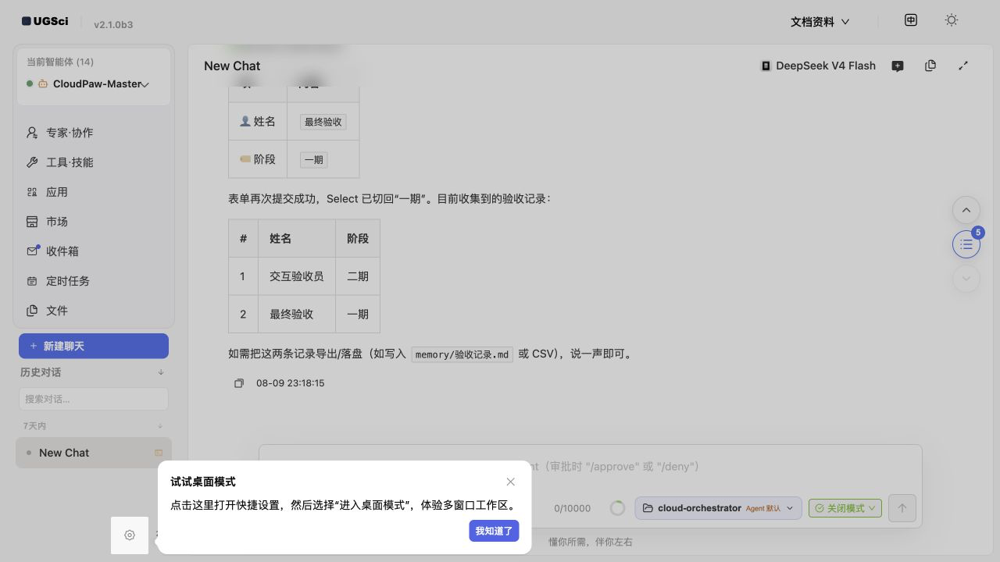
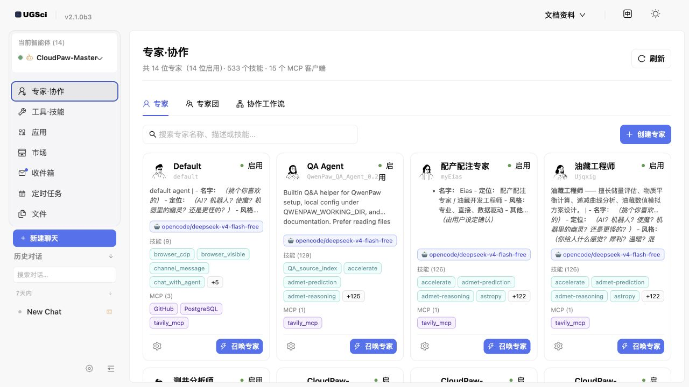
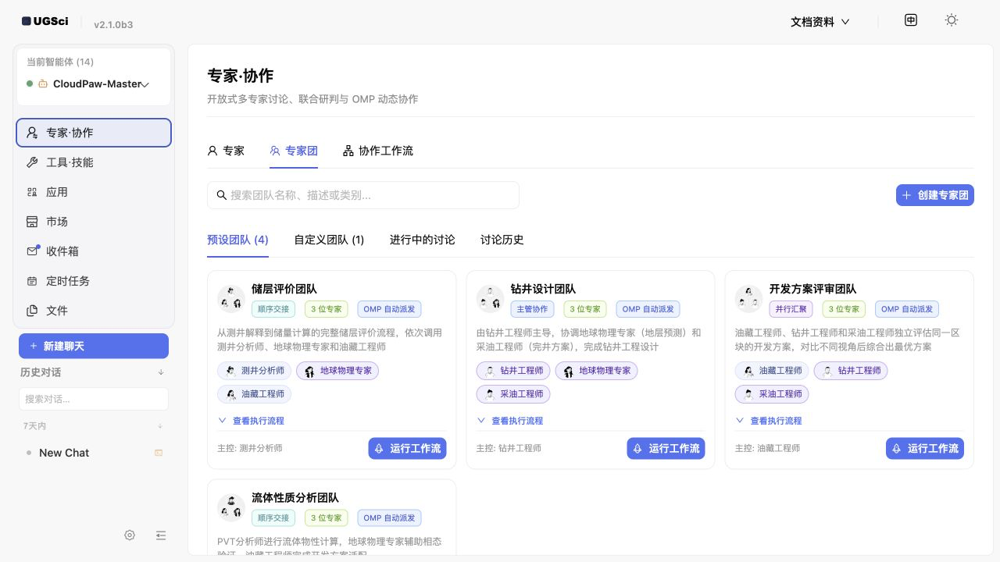
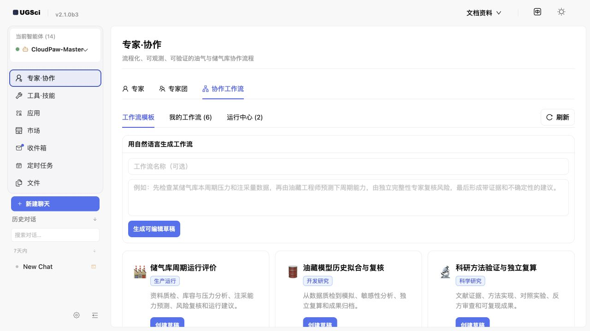
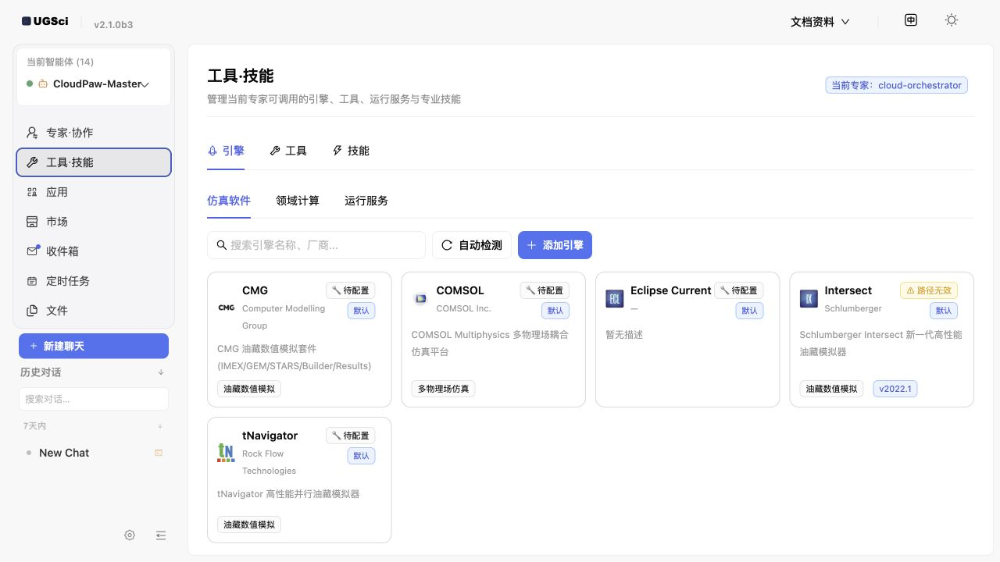
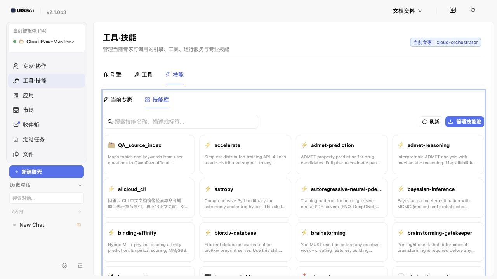
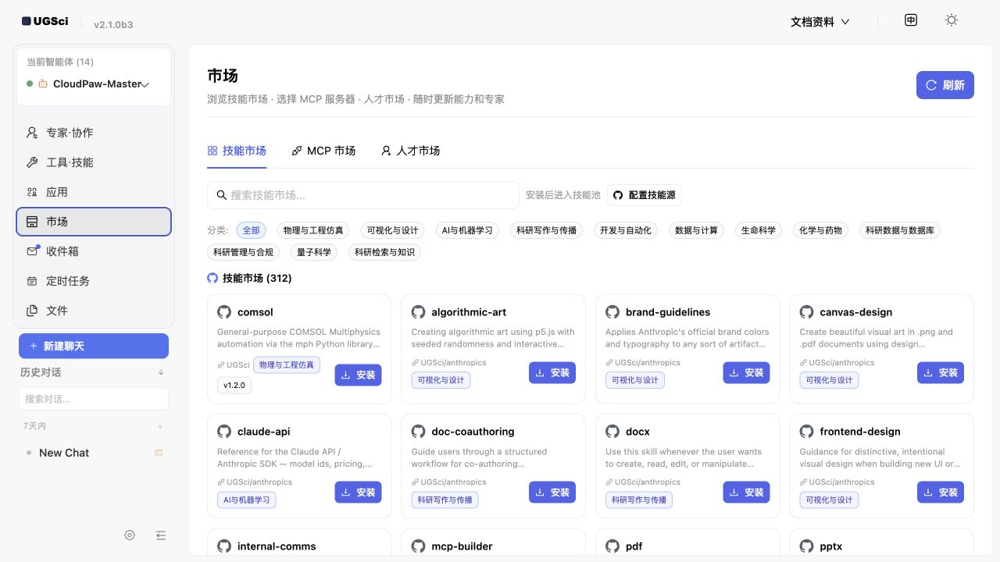
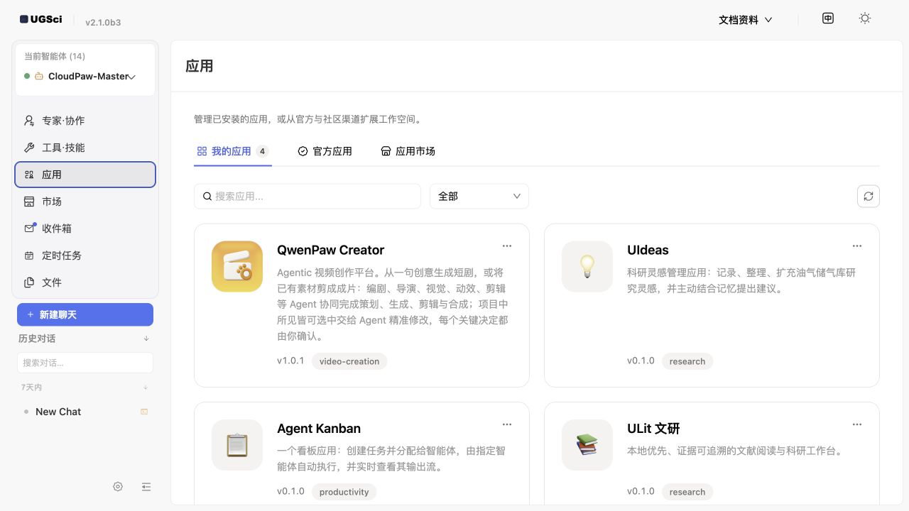

# UGSci 使用文档

本页说明 UGSci 是什么、适合谁、能解决什么问题，以及如何从第一次启动逐步使用专家、技能、引擎和专家团。你可以把它当作一份“从认识产品到完成专业任务”的操作手册，而不是 API 参考。

> 适用版本：UGSci {{UGSCI_VERSION}}；最低 QwenPaw {{QWENPAW_MIN_VERSION}}。本插件当前共包含 {{SKILL_COUNT}} 个内置技能。

## UGSci 是什么？

UGSci 是安装在 QwenPaw 中的石油与科研增强插件。它把通用的 AI 智能体组织成可以分工的数字专家，并提供技能、工具、本地软件引擎和协作工作流。你不需要先学习编程；只要会选择文件、阅读提示并用自然语言描述目标，就可以开始。

## 这份文档适合谁？

- 第一次使用 QwenPaw 或 UGSci，希望先知道“从哪里点、先做什么”的用户。
- 需要处理测井、生产数据、递减分析、仿真或科研资料的专业用户。
- 需要把多人复核、报告生成等重复工作整理成标准流程的团队负责人。
- 需要配置技能、MCP、软件引擎或排查运行问题的管理员和维护人员。

## UGSci 能做什么？

| 目标 | 使用入口 | 适合任务 |
| --- | --- | --- |
| 找专家 | 专家·协作 → 专家 | 选择、创建和配置领域专家 |
| 管理能力 | 工具·技能 | 管理技能、MCP 工具和本地软件引擎 |
| 组织协作 | 专家团、协作工作流 | 拆分复杂任务，顺序或并行复核 |
| 使用扩展 | 市场、应用 | 安装技能、MCP、专家模板和完整应用 |
| 生成结果 | 对话、GenUI | 生成图表、表单、看板和报告 |

## 推荐阅读路径

1. **第一次使用**：阅读“第一次启动”和“选择专家”，完成一个只读练习。
2. **处理专业文件**：阅读“文件、工作区与成果保存”，先建立输入和输出边界。
3. **提高可靠性**：阅读“工具执行安全”“技能库”和“常见故障”。
4. **处理复杂任务**：阅读“专家团”和“协作工作流”，学习如何拆分和验收。
5. **扩展能力**：阅读“市场”“应用”以及“官方文档地图”，按需查阅 QwenPaw 全局能力。

如果你只想先试一次，可以直接跳到[第一次可复制的提问](#first-prompt)；如果你负责团队落地，建议从[文件、工作区与成果保存](#workspace-files)开始。

这份手册面向第一次接触 AI 智能体、不会编程、也不熟悉服务器或 API 的用户。你只需要会使用浏览器、会选择文件、会输入自然语言，就可以跟着完成操作。

## 1. 先认识 UGSci：它不是“聊天机器人”，而是一组数字专家

UGSci 是安装在 QwenPaw 里的石油与科研增强插件。你可以把 QwenPaw 理解成一间数字办公室，把 UGSci 理解成办公室里的专家、工具柜、软件控制台和协作流程。

它主要解决四类问题：

1. **找对人**：按任务选择测井分析师、油藏工程师、钻井工程师等专家。
2. **用对工具**：给专家配置技能、MCP 工具和本地仿真软件。
3. **多人协作**：让多个专家按顺序或并行工作，再汇总结果。
4. **看懂结果**：通过表格、图表、表单和文件预览展示结果，而不只是输出长段文字。



图中最重要的区域：

- 左上角“当前智能体”表示现在正在和哪位数字专家工作。
- 左侧“专家·协作”用于找专家、组专家团、创建协作工作流。
- “工具·技能”用于管理软件引擎、工具和专业技能。
- “应用”是可以直接打开的完整工作应用。
- “市场”用于发现和安装更多技能、MCP 或人才模板。
- 右上角“文档资料”可以随时打开本手册。

<a id="first-prompt"></a>

### 第一次可复制的提问

```text
我是第一次使用 UGSci。请先不要执行任何外部工具，用通俗语言告诉我：
1. 当前专家擅长什么；
2. 我可以上传哪些文件；
3. 哪些操作需要我确认；
4. 给我一个最简单的练习任务。
```

**看到什么算成功：** 对话区出现分点说明，并且没有未经你同意就运行本地软件或改写文件。

## 2. 第一次启动：用 5 分钟完成安全检查

### 2.1 检查版本与页面

打开 QwenPaw 后，看左上角是否显示 UGSci 标识，并确认版本不低于本页顶部要求。若页面布局异常，先刷新浏览器；桌面版可以完全退出后再启动。

### 2.2 选择模型

模型相当于专家的“大脑”。没有可用模型时，专家卡片仍然存在，但不能正常回答。

建议：

- 普通问答、资料整理：选择速度快、成本低的模型。
- 长文档、复杂推理、跨文件分析：选择上下文更长、推理更强的模型。
- 图片、图表、扫描件：选择明确支持多模态的模型。
- 隐私数据：优先选择本地模型，或先做脱敏。

### 2.3 理解“工具执行安全”

页面右下角的安全模式决定专家能否自动运行工具。初学者建议保持较严格的模式：遇到文件写入、命令执行、外部发送等操作时，由你确认后再继续。

> 安全原则：把 UGSci 当成能力很强的新同事。可以让它分析和提出建议，但删除文件、覆盖成果、发送外部消息、运行昂贵仿真前，先让它说明目标、输入、输出和风险。

### 安全提问模板

```text
在执行任务前，请先列出：将读取哪些文件、将创建或修改哪些文件、是否调用网络或本地软件、预计耗时，以及哪些步骤需要我批准。未经批准不要删除或覆盖原文件。
```

## 3. 选择专家：先让合适的人处理问题

点击左侧 **专家·协作**，进入“专家”页。每张卡片代表一位独立专家，拥有自己的描述、模型、技能和 MCP。



### 3.1 如何看懂专家卡片

- **名称和简介**：说明专家主要负责什么。
- **启用**：绿色状态表示专家可使用。
- **模型标签**：专家当前使用的语言模型。
- **技能**：专家掌握的工作方法，例如测井解释、文献检索、数据分析。
- **MCP**：专家能够连接的外部服务或工具。
- **召唤专家**：切换到这位专家并开始对话。
- **齿轮按钮**：修改专家描述、模型、工具和技能。

### 3.2 不知道选谁时怎么办

先选择通用专家，把问题描述清楚，让它推荐合适角色：

```text
我的目标是评估一口井的储层质量。我有 LAS 测井文件、井位信息和少量岩心分析结果。
请判断需要哪些专家，说明每位专家负责什么，并告诉我应该先上传哪些文件。暂时不要开始计算。
```

### 3.3 创建专家的通俗方法

点击“创建专家”时，重点写好三项：

1. **专家是谁**：例如“油藏工程师”。
2. **擅长什么**：例如“递减分析、储量估算、开发指标诊断”。
3. **不该做什么**：例如“没有数据时不得编造结论；不得自动覆盖原始文件”。

示例描述：

```text
你是一名油藏工程师，擅长 Arps 递减分析、产量预测和 EUR 估算。
所有结论必须说明数据来源、假设、单位和不确定性。
原始数据只读；输出写入 results 目录；计算前先检查缺失值和时间单位。
```

## 4. 专家团：把复杂任务拆给多位专家

当任务同时涉及多种专业知识时，单一专家容易遗漏。切换到 **专家团** 标签，可以使用预设团队或创建自定义团队。



### 4.1 什么任务适合专家团

- 测井解释 + 地球物理 + 油藏评价。
- 钻井方案 + 地质风险 + 采油工程审查。
- 数据分析 + 独立复算 + 报告编写。
- 需要“一人做、一人查、一人汇总”的高可靠任务。

### 4.2 三种常见协作方式

- **顺序交接**：上一位专家的结果交给下一位，适合有固定先后关系的流程。
- **并行汇聚**：多位专家独立分析同一问题，再比较差异，适合方案评审和交叉验证。
- **主控协作**：主控专家拆任务、分派、检查、重试并汇总，适合复杂任务。

### 4.3 专家团任务示例

```text
请使用“储层评价团队”完成以下任务：
1. 测井分析师检查 LAS 曲线、单位、缺失值和异常段；
2. 地球物理专家评估层位对应关系和可能的深度偏移；
3. 油藏工程师根据可靠输入给出储层质量分级；
4. 每位专家列出证据和不确定性；
5. 主控专家只在证据一致时给出最终结论，有冲突时单独列出。
输出一份面向管理人员的摘要和一份技术附录。
```

**看到什么算成功：** 页面或对话中能看到任务被分派给不同角色，并最终产生汇总结果；不是同一个回答简单重复三次。

## 5. 协作工作流：把重复工作变成可复用流程

切换到 **协作工作流**。这里适合保存经常重复的标准流程，例如月度油藏评价、模型历史拟合复核、科研结果独立复算。



### 5.1 用自然语言生成流程

在文本框里描述目标、输入、角色、顺序和验收标准。建议遵循下面的结构：

```text
目标：生成月度单井递减分析报告。
输入：production.csv，字段包括 date、oil_rate、water_rate、well_name。
步骤：
1. 数据专家检查日期、单位、重复记录和停产点；
2. 油藏工程师分别拟合指数、双曲和调和递减；
3. 独立复算专家验证参数范围和 EUR；
4. 报告专家汇总最佳模型、误差和风险。
验收：原始文件只读；单位必须标注；结果包含图表、参数表和不确定性说明。
```

点击“生成可编辑草稿”后，先检查流程是否符合你的业务习惯，再保存或运行。

### 5.2 初学者最容易忽略的三件事

1. 输入文件的字段名和单位要写清楚。
2. 给每个角色指定“完成条件”，避免流程一直讨论不结束。
3. 指定最终由谁汇总，避免得到多份彼此矛盾的结论。

## 6. 工具、技能、MCP、引擎：四个词到底有什么区别

它们可以用厨房来理解：

| 名称 | 通俗比喻 | 例子 | 需要注意 |
| --- | --- | --- | --- |
| 工具 | 刀、秤、烤箱等基础器具 | 读文件、运行命令、浏览网页 | 权限较强，执行前看清影响 |
| 技能 | 菜谱和工作方法 | 测井分析、递减分析、写报告 | 决定“如何做”，不一定直接连接软件 |
| MCP | 标准化的外部工具插座 | GitHub、数据库、知识库服务 | 可能需要账号、密钥或网络 |
| 引擎 | 已安装的专业计算软件 | CMG、COMSOL、Eclipse、Intersect | 可能需要许可证、路径和计算资源 |

### 6.1 检测本地仿真软件

进入 **工具·技能 → 引擎 → 仿真软件**，点击“自动检测”。UGSci 会查找常见安装路径和可执行文件。



页面状态的含义：

- **默认**：系统自带的引擎定义。
- **待配置**：认识这种软件，但还没有可用路径或许可证信息。
- **路径无效**：配置过，但当前路径找不到文件，常见于软件升级、移动目录或跨电脑复制配置。

如果自动检测没找到，不代表软件不能用。点击“配置”，手动选择安装目录或可执行文件，并确认当前用户有权限启动。

### 引擎配置检查模板

```text
请只做只读检查：确认当前仿真引擎的可执行文件路径、版本、许可证配置和输出目录是否有效。
不要启动正式计算。请列出发现的问题和我需要手动确认的事项。
```

## 7. 技能库：给当前专家补充工作方法

进入 **工具·技能 → 技能 → 技能库**。技能库展示可供专家使用的方法。搜索框可以按技能名称、描述或标签查找。



### 7.1 技能池和当前专家有什么区别

- **技能池**：像公司的公共培训资料库，所有专家都可以从中选择。
- **当前专家技能**：像某位员工已经领取并启用的工作手册。

技能在技能池里，并不等于当前专家已经会用。切换到“当前专家”，确认技能已启用。

### 7.2 选择技能的原则

- 一次只启用任务真正需要的技能，避免工具太多导致选择混乱。
- 查看技能说明，确认它要求的输入格式和依赖软件。
- 对来自市场或第三方的技能，先阅读说明并通过安全扫描。
- 高风险技能先在副本数据上试运行。

### 技能选择示例

```text
我要处理一批 LAS 文件，并输出质量检查报告、标准化曲线名和异常井段清单。
请先从技能库中推荐最少数量的必要技能，解释每个技能的作用、输入和输出。等我确认后再启用。
```

## 8. 市场：安装更多技能、MCP 和人才模板

点击左侧 **市场**。市场包含技能市场、MCP 市场和人才市场。市场内容可能来自外部仓库，因此安装前要确认来源和权限。



### 8.1 安装前的四项检查

1. 来源是否可信，最近是否维护。
2. 是否需要 API Key、数据库密码或外部账号。
3. 是否会读取工作区之外的文件、执行命令或访问网络。
4. 是否和现有技能功能重复。

### 8.2 安装后的正确步骤

安装成功后，技能会进入技能池。然后回到 **工具·技能 → 技能 → 技能库/当前专家**，把它分配给需要的专家。

> 安装技能不等于自动给所有专家开放。分开管理可以减少误操作，也让每位专家的职责更清晰。

## 9. 应用：直接使用完整工作台

“应用”不是单个技能，而是带有完整页面、流程和数据管理能力的工作空间。适合经常重复、需要固定界面的任务。



页面通常分成三类：

- **我的应用**：已经安装、可以直接打开的应用。
- **官方应用**：官方提供或推荐的应用。
- **应用市场**：可以继续发现和安装扩展应用。

使用应用前，先阅读它的数据目录、权限和输出位置说明。涉及重要项目时，建议先复制数据到独立项目目录。

## 10. 三个完整示例：从提问到结果

### 示例 A：LAS 测井文件质量检查

**你准备：** 一个或多个 `.las` 文件，最好保留原始文件副本。

**复制提问：**

```text
请检查我上传的 LAS 文件。先不要做储层解释，只做数据质量检查：
1. 识别井名、深度范围、步长和单位；
2. 检查必需曲线、重复深度、缺失值、异常值和曲线命名；
3. 给出可自动修复项和必须人工确认项；
4. 原文件只读，把标准化副本和报告输出到 results/welllog_qc；
5. 最后用表格汇总每口井的质量等级。
```

**成功结果应包含：** 输入文件清单、每口井的问题、单位说明、异常区间、修复记录和输出文件链接。

**常见问题：**

- 曲线名不同：让专家先建立别名映射，不要直接删除未知曲线。
- 深度单位不明：暂停计算，人工确认是 m 还是 ft。
- 文件乱码：尝试常见编码，并保留转换日志。

### 示例 B：生产数据递减分析

**你准备：** CSV 或 Excel，至少包含日期、井名、产量；明确日产还是月产。

**复制提问：**

```text
请对 production.csv 做单井递减分析。
先检查日期连续性、产量单位、停产点和异常值；再比较指数、双曲、调和三种 Arps 模型。
训练区间和预测区间要明确分开，给出拟合误差、参数、EUR 和不确定性。
不要把停产期间的零值直接当成正常递减点。输出图表、参数表和管理摘要。
```

**成功结果应包含：** 数据清洗说明、拟合区间、模型比较、参数单位、预测曲线和风险提示。

### 示例 C：生成可交互的项目验收看板

首页对话支持 GenUI：专家可以生成真实的卡片、图表、表单和按钮，而不是只写 Markdown。


**复制提问：**

```text
请调用 GenUI 工具生成一个“项目验收看板”：
1. 顶部显示总体完成率；
2. 用柱状图比较一期与二期的功能、性能、文档和安全验收；
3. 提供姓名和阶段的提交表单；
4. 提交后在对话中回显记录；
5. 支持导出 PNG 或 PDF。
不要只输出 Markdown 表格。
```

**看到什么算成功：** 对话中出现可以输入、选择和点击的真实界面；点击提交后，数据能回传到对话。

<a id="workspace-files"></a>

## 11. 文件、工作区与成果保存

每位专家都有独立工作区。把它理解成这位专家自己的项目文件夹：输入、临时文件、结果、记忆和对话记录可以相互隔离。

推荐目录：

```text
project/
├── input/          # 原始数据，只读保存
├── working/        # 中间过程和临时文件
├── results/        # 最终图表、表格和报告
├── references/     # 标准、论文和说明书
└── README.md       # 项目目标、单位、版本与负责人
```

### 文件任务模板

```text
请把 input 目录视为只读。所有中间文件写入 working，最终成果写入 results。
若目标文件已经存在，先生成带时间戳的新文件，不要覆盖。
完成后列出新建和修改过的文件，并说明如何复现结果。
```

## 12. 常见故障：先按现象排查

| 现象 | 常见原因 | 处理方法 |
| --- | --- | --- |
| 专家不回答 | 没有配置模型、模型不可用 | 在设置中检查模型和 API Key，本地模型确认已启动 |
| 看不到 UGSci 页面 | 插件未启用、前端缓存 | 重启 QwenPaw，刷新或清理页面缓存 |
| 技能在库里但专家不会用 | 没分配给当前专家或未启用 | 到“当前专家”检查技能状态 |
| 自动检测不到软件 | 非默认安装路径、权限不足 | 手动配置可执行文件和安装目录 |
| 路径无效 | 软件移动、版本升级、跨电脑复制配置 | 重新选择路径并保存 |
| 图片无法理解 | 当前模型不支持多模态 | 切换支持图片的模型 |
| 结果没有图表/表单 | 模型只输出了文字，没有调用 GenUI | 明确要求“调用 GenUI 工具，不要只输出 Markdown” |
| 专家团结果矛盾 | 任务边界或汇总规则不清 | 要求各自列证据，由主控专家比较冲突 |
| 计算很慢 | 数据大、模型慢、仿真耗时 | 先用小样本验证，再运行完整任务 |

### 通用诊断提问

```text
请不要立即重试。先诊断刚才失败的原因，并按“现象、可能原因、证据、最小修复步骤、是否会修改文件”输出。只有我确认后再执行修复。
```

## 13. 官方文档地图：这份手册和哪些页面对应

Roadmap 只是官方文档站中的一个页面。为了让你在遇到更大范围的问题时知道去哪里查，本手册同时参考了官方文档站的以下主题；仓库中也保留了对应的中文 Markdown 镜像，构建时不需要联网。

| 官方主题 | 官方页面 | 本手册对应章节 | 你什么时候需要它 |
| --- | --- | --- | --- |
| 项目介绍 | [intro](https://qwenpaw.agentscope.io/docs/intro) | 第 1、2、14 章 | 第一次了解产品边界和基本概念 |
| 快速开始 | [quickstart](https://qwenpaw.agentscope.io/docs/quickstart) | 第 2 章 | 安装、初始化、启动服务 |
| 控制台 | [console](https://qwenpaw.agentscope.io/docs/console) | 第 1、3、5、9 章 | 理解页面入口、智能体和工作区 |
| 模型 | [models](https://qwenpaw.agentscope.io/docs/models) | 第 2、3、13 章 | 配置云端模型、本地模型和多模型切换 |
| 频道 | [channels](https://qwenpaw.agentscope.io/docs/channels) | 第 2、13 章 | 把 QwenPaw 接入钉钉、飞书、QQ 等 |
| Skills | [skills](https://qwenpaw.agentscope.io/docs/skills) | 第 6、7、8 章 | 安装、启用和编写技能 |
| MCP 与工具 | [mcp](https://qwenpaw.agentscope.io/docs/mcp) | 第 6、7、8 章 | 连接外部服务和理解权限 |
| 多智能体 | [multi-agent](https://qwenpaw.agentscope.io/docs/multi-agent) | 第 3、4、5 章 | 创建多个独立专家和协作 |
| 长期记忆 | [memory](https://qwenpaw.agentscope.io/docs/memory) | 第 2、11、14 章 | 保存偏好、项目知识和可检索记忆 |
| 上下文管理 | [context](https://qwenpaw.agentscope.io/docs/context) | 第 2、11、14 章 | 对话过长、需要压缩或回溯原文时 |
| 安全 | [security](https://qwenpaw.agentscope.io/docs/security) | 第 2、6、8、12 章 | 工具守卫、文件访问和技能扫描 |
| 配置与工作目录 | [config](https://qwenpaw.agentscope.io/docs/config) | 第 2、11、12 章 | 搬迁数据、备份、排查路径问题 |
| CLI 与魔法命令 | [cli](https://qwenpaw.agentscope.io/docs/cli)、[commands](https://qwenpaw.agentscope.io/docs/commands) | 第 12、15 章 | 服务诊断、停止任务、重启和自动化 |

阅读方法很简单：先用本手册完成当前任务；如果问题涉及整个 QwenPaw 的安装、频道、模型或安全策略，再点击上表的官方页面。UGSci 只扩展领域能力，不会替代 QwenPaw 对全局配置、账号密钥和频道安全的说明。

## 14. 官方 Roadmap：哪些是现在能用，哪些还在路上

本节参考 QwenPaw 官方[路线图](https://qwenpaw.agentscope.io/docs/roadmap)。Roadmap 会变化，本地手册只说明本版本与官方方向的关系，不把未来计划写成已经完成。

| 官方方向 | 官方状态 | 本版本中你能看到什么 | 使用建议 |
| --- | --- | --- | --- |
| 更多频道、模型、技能、MCP | 征集中 | UGSci 市场、技能池、MCP 和专家配置 | 新扩展先检查来源、权限和兼容性 |
| 展示优化、下载提示、Windows 路径兼容 | 征集中 | GenUI、文件预览、跨平台本地文档 | 遇到路径问题保留完整报错和系统版本 |
| 多模型切换 | 进行中 | 专家可以配置模型，具体切换体验随上游版本演进 | 重要任务记录实际使用的模型与版本 |
| Browser-use Chrome 扩展 | 进行中 | 可使用浏览器相关工具；扩展支持取决于当前安装 | 涉及登录和外部提交时保留人工确认 |
| 长期记忆个人知识库 | 进行中 | 每个智能体拥有独立工作区和记忆能力 | 不把项目机密无边界地写入公共空间 |
| QwenPaw Creator / Insight | 进行中 | “应用”页可管理已安装应用 | 以实际安装页面为准 |
| 兼容既有 Agent、群聊、Subagent 可视化 | 计划中 | UGSci 已有专家团和协作工作流，但不等于官方规划项全部完成 | 不要根据 Roadmap 假设当前版本已有对应入口 |


## 15. 术语表：一分钟查懂页面上的词

| 术语 | 一句话解释 |
| --- | --- |
| 智能体 / Agent | 有独立模型、工作区、记忆、工具和技能的数字助手 |
| 专家 | 加入领域角色、职责和专业能力后的智能体 |
| 专家团 | 多位专家按照协作规则共同完成任务 |
| 工作流 | 可重复运行的分步工作模板 |
| 技能 / Skill | 教给智能体如何完成某类任务的方法与资料 |
| 工具 / Tool | 读文件、执行命令、浏览网页等可实际操作的能力 |
| MCP | 让智能体连接外部工具或服务的标准协议 |
| 引擎 | CMG、COMSOL、Eclipse 等专业计算软件或运行服务 |
| GenUI | 在对话中生成可交互卡片、图表、表单和按钮的能力 |
| 工作区 | 某位智能体独立使用的文件、记忆和配置空间 |
| 上下文 | 当前对话中模型能够看到和理解的信息 |
| Token | 模型读取和输出文本时使用的计量单位 |

## 16. 最后检查清单

开始正式项目之前，逐项确认：

- [ ] 已选择适合任务的专家或专家团。
- [ ] 模型支持所需能力，例如长文、图片或复杂推理。
- [ ] 原始文件已备份，并约定 input 只读。
- [ ] 数据单位、时间范围和字段含义已写清楚。
- [ ] 只启用了必要的技能、工具、MCP 和引擎。
- [ ] 外部发送、文件覆盖、命令执行和正式仿真保留人工确认。
- [ ] 输出目录、文件格式和验收标准已说明。
- [ ] 最终结果包含证据、假设、单位、不确定性和复现方法。

如果不知道从哪里开始，复制这句话：

```text
请把我的目标拆成最小可执行步骤。先问我最多 5 个必要问题，然后推荐专家、技能和输入文件。没有得到确认前，不运行工具、不修改文件。
```

---

UGSci {{UGSCI_VERSION}} · 最低 QwenPaw {{QWENPAW_MIN_VERSION}} · {{SKILL_COUNT}} 个内置技能
官方路线图：<https://qwenpaw.agentscope.io/docs/roadmap>
